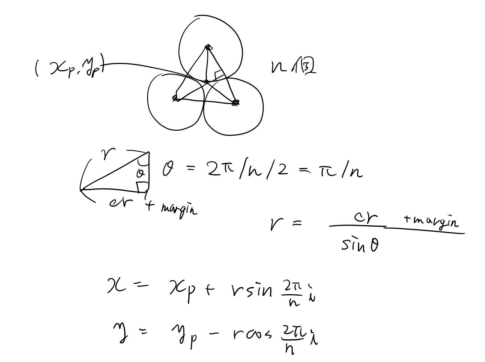

# 椅子取りゲーム
これはJavaで作成したオンラインリアルタイム椅子取りゲームのプロジェクトファイルです。 

## Usage
### Java 
1. [Install gradle.](https://dev.classmethod.jp/articles/gradle-step-by-step/). 
    - どうしてgradleが必要なんですか <- 外部パッケージを使うのに便利そうだったから。 
2. ~~build: ```gradle build```~~ 開発時にはbuildせずに直接runで大丈夫なはず... 
3. run: ```gradle run``` 
4. if you want to clean, run ```gradle clean```. 
5. check [settings](#settings)

### Docker (If Server Only)
1. ```docker compose up``` 
2. ```localhost:8080```以外を使う場合は、```.env```ファイルの作成 (テンプレート: [.env.template](.env.template) )


## Settings
- プログラムファイルの場所: src/main/java
    - 以下、${program}と略記する。
- 環境変数として指定するHOSTNAMEとPORTの値が接続先のサーバになります。デフォルトではlocalhostの8080番ポートです．
- クライアントの実行数は[GameFrame.java](./src/main/java/Client/GameFrame.java)のclientNumの値を変えて設定してください． 
- クライアントのみ起動する、サーバのみ起動する、クライアントとサーバを両方とも起動する、などの設定変更はbuild.gradleのmainClassを変更してください。 

## これから変更していく場所
- レスポンス受け取った時の処理の追加: 
    1. ${program}/Common/Model/SocketModel.javaに新しくclassを追加(他に習って)
    2. ${program}/{Server | Client}/Socket/Handler/JsonHandlerにそのclassで場合わけするelse ifを追加。また後でOverrideできるpublicな関数をそこで実行
    3. 
        - Serverの場合、${program}/Server/Room/User/GameUser.javaのコンストラクタ内でjsonhandlerの関数をOverrideして具体的な関数を書く。 
        - Clientの場合、${program}/Client/GameFrame.javaのnew Client()のところでOverrideして具体的な処理をかく。

- リクエストを送る
    - Clientの場合、${program}/Client/GameFrame.javaのclient.Send()で送る。引数には${program}/Common/Model/SocketModel.java内のクラスのインスタンスを用いる。
    - Serverの場合、${program}/Server/Room/Room.javaのPublish()で部屋内のユーザー全員に送信、またはSendMessage()で特定のユーザー一人に送信。引数には${program}/Common/Model/SocketModel.java内のクラスのインスタンス，及び送信対象のユーザーを用いる。 

- ゲームロジックの記述
    - Client: ${program}/Client/GameFrame.javaに書く。
    - Server: ${program}/Server/Room/Round/Round.javaのrun()内にラウンド内のゲームロジックを書く。handleMoveReqみたいに，生き残ったプレイヤーをroomSurvivedUserIDsに追加する。ラウンド終了時にroomSurvivedUserIDsの長さが1以下だった場合、ゲームを終了し、2以上だった場合、新たなRoundが作られる。 
    - +上の「レスポンス受け取った時の処理」でゲームロジックを書く 

## 動かし方を変える
- /Client/GameFrame.javaのmain()内のclientNumで実行するクライアントの数を変えられる
- /build.gradleのmainClassで実行するクラスを変えられる(サーバーのみ動かす、クライアントのみ動かす、など) 

## 椅子の座標の計算
$cr = \mathrm{circleRadius}\ (椅子の半径),\ margin = 椅子同士の余白,\ r = (x_p, y_p) と椅子の中心座標の距離$.

分かりにくすぎる



# 議事録
- [議事録](https://hackmd.io/dfl9Z-KDSAu5qTyQEfvXHg) 

# 改善可能点だと思うところ
- ユーザーがどれだけ入ったかを確認してからゲームを開始するように、GUIでゲームスタートボタンを実装したい。 
- 色が必ずしもユニークではない。 

<!--
Unknown, Uncertain bug: 
- dockerを起動している時には外部ライブラリがうまく使えない(?)  
-->
